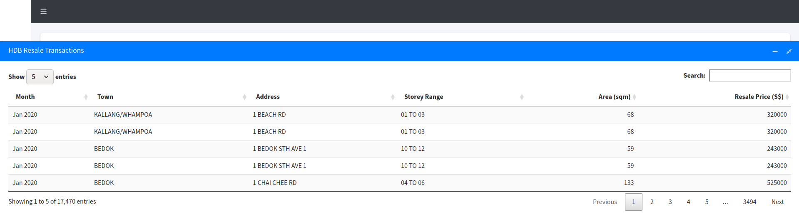

This user guide will explain how you can use this dashboard. There are 4 components in this visualisation, which will be explained below.

# Dashboard Components

All components within the dashboard are expandable and collapsible - you can expand or collapse the component using the expand/minimise buttons on the top right of every box.

## Key Indicators

To see key figures for another year, slide the year slider (on top) which will show the relevant figures for that year.

## HDB Resale Price vs Singapore Economy Graph

You can hover over the points for the HDB Resale Price and Singapore GDP figures for any particular year.

## HDB Resale Prices Overview

This component is split into two parts.

### Map

The map shows the median price of the HDB resale flats. The red dots represent a housing block, for which you can click on the red dot to reveal the figures for each block.

To see a town-wide distribution, we have also included MRT stations in the map. You can use the search function on the left of the map to search by MRT station.

To see resale prices by year and HDB Type, click the gear icon on the top-right of the container, where a popup will show. Slide the slider to select the year you would like to see, and select a HDB Type from the dropdown box. You can also reset the map to its original zoom level.

### HDB Resale Transactions

This data table shows the list of HDB resale transactions for the period and the flat type that has been selected in the **Map** section above.

You can select the number of entries to show (5, 10, 25, 50, 100) from the dropdown on the top left.

You can also search for a town or specific address using the search function on the top right.

## HDB Resale Prices Estimate

This component allows you to estimate the resale price of a HDB flat depending on 4 factors:

- Flat Type
- Floor Area (sqm)
- Storey Range
- Distance to CBD (m)

For **Flat Type** and **Storey Range**, you can select from a dropdown box which have the choices provided. For **Floor Area (sqm)**, input a floor area in square metre which can be a range between **68** and **297**. For **Distance to CBD (m)**, input a value in metres.
